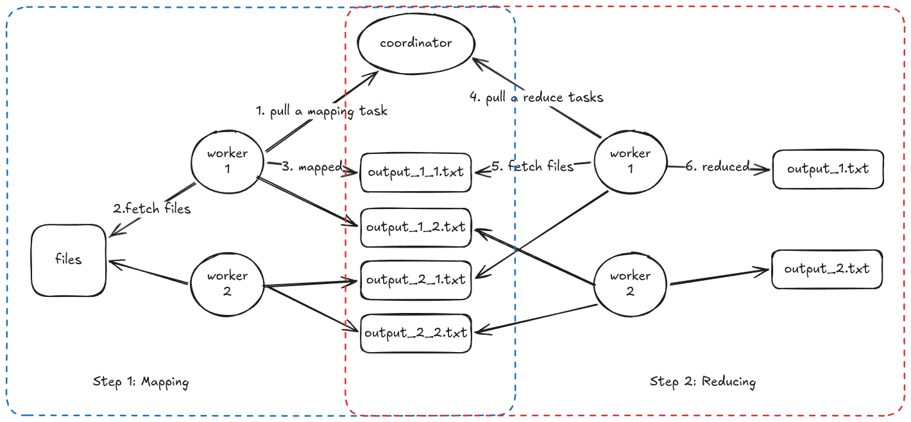
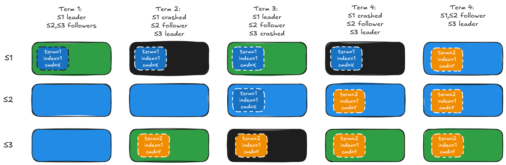
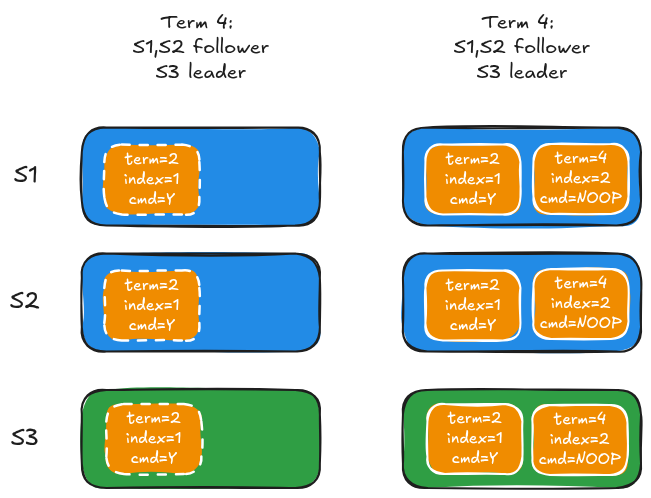
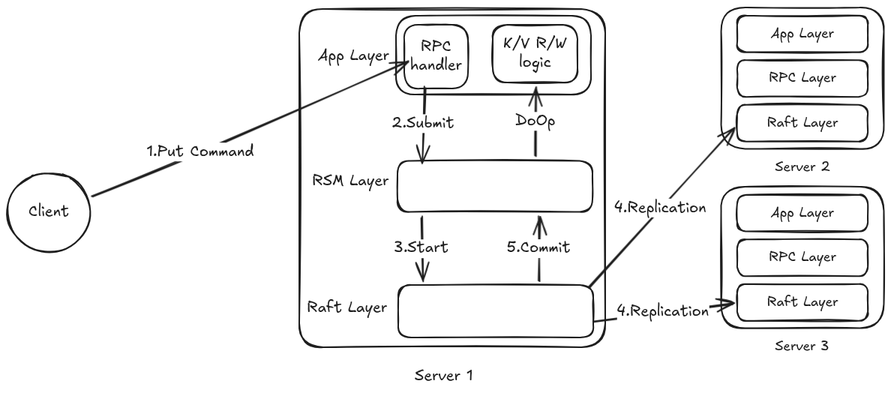
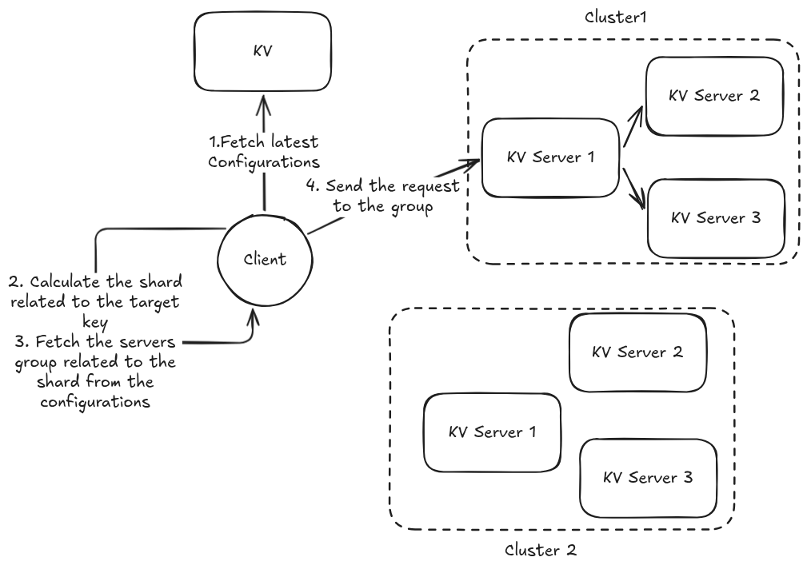
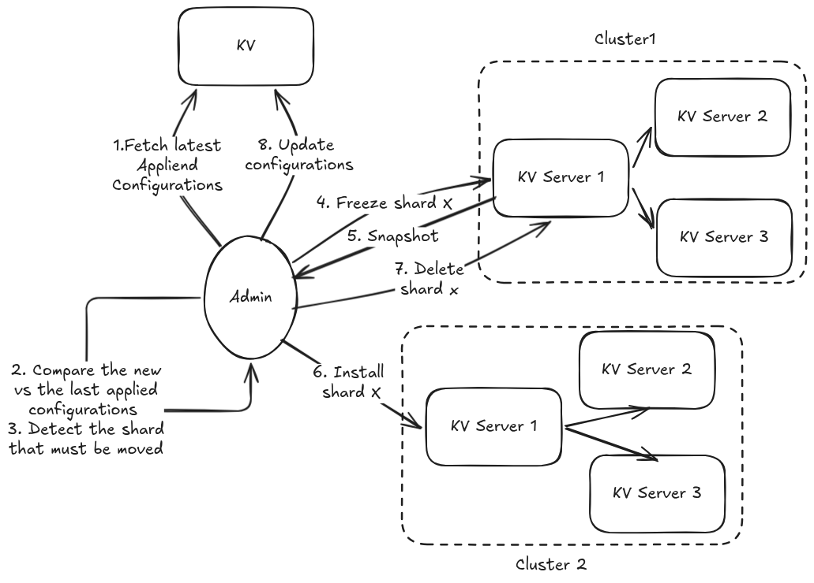
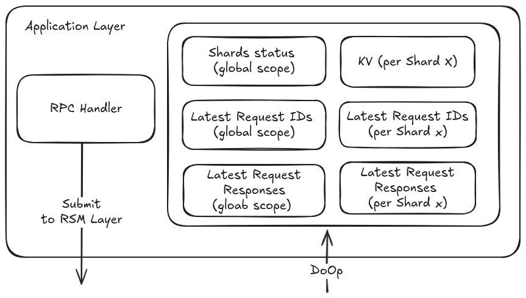

# Introduction
This repo contains my solutions for the 5 labs proposed on the open distributed system course:[MIT 6.5840](http://nil.csail.mit.edu/6.5840/2025/schedule.html).

The labs cover the following systems:
1. The MapReduce system is inspired by [MapReduce paper (by google)](http://nil.csail.mit.edu/6.5840/2025/papers/mapreduce.pdf). 
2. A Key/Value server
3. Raft consensus algorithm ([paper](http://nil.csail.mit.edu/6.5840/2025/papers/raft-extended.pdf))
4. Replicated Key/Value server on top of Raft
5. Sharded Key/Value server where each shard is replicated, with the possibility of moving shards at runtime  

Each lab proposes a skeleton and asks you to implement the logic from scratch. Automated tests are provided with the lab to help the students validate their implementation. The tests check the robustness of the system under different conditions:  network dropping packets or delivering packets out-of-order, simulation of network partitions, server crashes or restarts, and load testing.

Every solution passed at least 100 iterations. 

# Lab1: MapReduce
## Objective
This lab is inspired by the system described in the [MapReduce paper (by Google)](http://nil.csail.mit.edu/6.5840/2025/papers/mapreduce.pdf). 
The objective is to easily split big workloads among many workers to get the results faster. 
This approach is applicable to some kinds of problems, like counting words for a set of files.

## System description 

At the heart of the system, there's a single instance coordinator that decides how the tasks should be assigned to the worker.
The workers periodically check with the coordinator to ask for new tasks. 
A task can be Mapping or Reduce. 
The Mapping tasks take the row files, process the data, and split the output using a hash function.
The Reduce tasks aggregate the results from the previous. 
The Coordinator starts by assigning the map tasks first. Once all the map tasks are done, the coordinator starts assigning the reduce tasks.

## Challenges
### Detecting failure vs reassigning tasks 
When the coordinator assigns a task to a worker, this task will no longer be visible for the other workers to take.
Once the worker completes the task, it will notify the coordinator to remove it.
If the worker crashes, is too slow, or there's a network partition, the coordinator will not have the capacity to predict if the worker will submit the results  or not. Due to this issue, the coordinator gives each worker a limited time. If the worker doesn't complete the task within the time and doesn't notify the coordinator, the coordinator will assign the same task to another worker. 

This behavior of the coordinator leads to a problem. If a worker takes a task and is too slow, the coordinator will reassign the task to another worker. We'll have two workers process the same task at the same time. We have multiple potential scenarios:
1. Both of the workers write at the same time, which will result in the corruption of the output file, or
2. The new worker finishes before the slow work, and it notifies the coordinator. The coordinator starts assigning the reduce tasks. Finally, the slow worker starts writing the output, corrupting the inputs of the reduce tasks.

To avoid that problem, we need to guarantee two properties:
1. Idempotency: if more than one worker processes a task, the final result should not change.
2. Atomicity: once a worker completes a task, it should write the results at once. There's no chance that a reader trying to fetch the output gets incomplete content. We care about this especially in the second scenario. Without atomicity, if a slow mapping worker starts writing its results while a reducer is working on the same set of files. The reducer will execute its task with incomplete/corrupted inputs. The final result will be wrong/incomplete.

For the idempotency, if two workes handles the same task will produce the same output files with the same content, and only one result will be kept in the system. 

For the atomicity, each worker creates a set of random temporary files where it'll save its results. At the end, the worker will rename all the files to the expected name. If a reducer starts reading a file, and a slow mapping worker starts producing its output in parallel, there'll be no risk for the reducer to get incomplete data. The rename operation is atomic, so the reader will have access to either the old or the new version but not something in between.

# Lab2: KV server
## Objective
The goal is to build a KV server that works on unreliable networks. On the last step of the lab, we built a distributed lock system. Many clients want to perform a task concurrently, but only one should be allowed at any given time.

The KV will be used to coordinate the communication between the client.
The idea is that every client will have an ID. When a client wants to acquire a lock, it tries to set a key, for example "lock", to its ID.
When another client tries to acquire the lock, 
1. It'll fetch the value of the "lock" key.
2. If the "lock" value is empty, this means that the lock is already released, then try to set "lock" to the new client's ID.
3. If the "lock" value equals a client ID, this means a previous client is holding the lock, then wait and retry later.

## System description 
The system is composed of a client and a KV server only.

## Challenges

1. If two clients fetch the lock key at the same time, both notice that the lock is released and try to update the key at the same time. How can we guarantee that only one client will gain access to the lock?
2. In some scenarios, the network is unreliable. What will happen if the client's request is dropped before reaching the server? And what if the server receives the client's request, updates the key, but the response is lost? 

The answer for the racing writes is to use versioned values. Every time a client wants to update a value of a key, it'll attach the last version number it knows. Before updating a key, the server compares the client's provided version and the current value. If the versions match, the server will update the value and increment the version number. If not, the server will return an error.

For example:
* The current version of the "lock" is 2, and the value is empty.
* Two or more clients want to acquire the lock. They fetch the value with the version.
* Each client will try to update the "lock" to its ID. The payload will have value=ClientID and version=2
* The server receives all the requests and starts processing them one by one.
* After processing the first request, the "lock"'s value will equal the ID of one of the clients, and its version becomes 3
* All the next requests will be rejected, because the versions will no longer match (2 on the payload vs 3 on the server)

The pending clients will have to wait, check the lock periodically until it's released, and finally send another acquire request.

For the unreliable network issue, a client, desiring to acquire a lock, may retry sending its request after a network failure. This should not be a problem as the operations can be retried safely without breaking the correctness. Once the client receives a successful response from the server, the response might be: 

OK: the key updated successfully, the client can assume that the lock is granted.

ErrVersion: received after the first attempt means that another client has already acquired the lock. 

When the client receives this response after a retry, we have two possible interpretations. The previous request has update the successfuly, and it's failing because the payload version mismatches the server's version, or another client has already updated the key. In this case, the client has to fetch the "lock" value to check if it matches its ClientID or not. 

# Lab3: Raft algorithm
## Objective
Lab3, Lab4, and Lab5 are connected. Each lab adds a layer on top of the previous one.
The lab3 focuses on the lower layer, the consensus algorithm. It's responsible for the leader elections and the command log replications. 
The lab4 builds a KV server on top of lab3. We have a replicated KV server system that tolerates the failure of a few nodes. To tolerate the failure of f servers, we'll need to have a total of 2f+1 servers on the system. For example: if we wish to tolerate the failre of 3 servers, we'll need 7 (3*2+1) servers on the system.
The Lab5 will be built on top of the 3 previous labs. The result will be a sharded KV server system. 
* The KV server and clients from lab 2 will be used to store the configurations of the cluster. 
* The replicated KV server from lab 4 will be upgraded to support installing and moving shards.
The user will have the option to move shards between replicated kv servers cluster to load balance the workload on realtime. 

The objective of lab3 to implement the main parts of the Raft algorithm described in the [paper](http://nil.csail.mit.edu/6.5840/2025/papers/raft-extended.pdf)
We have a set of servers, each of which has a log of commands. We want to synchronize those servers when the client submits a command. The system should continue serving the clients even if a few nodes crash; the system has to be fault-tolerant.
The main features:
1. Leader election: at any given time, the system should have one leader at most.
2. Log replication: the servers' logs must be synchronized over time. All the committed commands should be identical on all the servers.
3. Persistence: if a server crashes and then restarts, it should persist some data on the disk that allows it to rejoin the system quickly
4. Snapshots, or log compaction: after serving the clients for a while, the commands log might become too long. The logs compaction reduces workload when the server restarts, when a leader needs to synchronize a follower who is far behind, and alse reduce the needed storage space for persistence.

## System description 
Here's a brief description of the algorithm; the details are in the paper.
The system is composed of several nodes. We need at least 3 nodes to tolerate the failure of 1 node. 
A server can be in one of the following states: follower, candidate, or leader.
When a server starts up, it starts on follower state. After a random period, called elections timeout, the server promotes itself to a candidate and starts an election process. 
A candidate sends vote requests to all the nodes on the system to ask for a vote. A candidate will vote for itself.
If a candidate collects a majority (>N/2) vote, it'll be promoted to a leader.
A leader will be responsible for:
* replicating the logs to the other servers
* deciding the commands to be committed

The process works as follows: 
1. The client submits a command to the leader.
2. The leader appends the command as a new entry to its log,
3. The leader sends the new entry to the  followers,
4. The followers append the new entry  to their logs,
5. The leader tracks the replication process. When it detects that the entry is replicated on a majority, it commits the command and sends it to the apply channel.

The protocol guarantees the following properties:
1. Election safety
2. Leader append-only
3. Log matching
4. Leader completeness
5. State machine safety

### Election safety
The protocol guarantees that at most one server will be elected as a leader per term. 

To become a leader, a server must collect a majority of votes (>N/2), including itself. A node is allowed to vote only one time per term. 
It's not possible for two nodes to collect a majority at the term.  

In worst cases, we'll have a split vote where each candidate collects half of the servers, for example: we have 4 servers and 2 candidates for a given term, each candidate collects 2 votes. In this situation, the candidate will increment the term number and start new elections. 

One potential liveness problem in this situation: if the two candidates start the new term elections at the same time, the new term elections may end up with a split vote, too. If the split vote continues to happen, the system will be stuck and not respond to the client requests.

To avoid that problem, each follower/candidate has a timer called the election timeout. This timer receives a random value on each reset. 
This randomness help reducing the risk of having more than one candidate starting the elections at the same time.  

The timer serves a more generic purpose. It protects the system from being stuck. A follower keeps monitoring this timer and restarts it every time it receives a heartbeat from the leader or a vote request from a new term. If the leader crashes or disconnects, the follower will rely on this timer to trigger a new election.

### Leader append-only
I believe this feature simplifies the protocol. A leader only needs to communicate using "AppendEntry" to force followers to synchronize their logs with its log.
If a leader can update or delete the entries from its log, more communication functions will be needed. The communication flow will be more complex.

### Log matching
from the paper: " if two logs contain an entry with the same index and term, then the logs are identical in all entries up through the given index."

When the leader sends a heartbeat to the follower, the leader keeps track of the last matching indexes. If an entry on the follower doesn't much latest entry on the leader, the leader will check the earlier indexes. 
When the leader finds where the two logs match, it'll force the follower to overwrite all the unmatching logs.
In addition, the leader never replaces or overwite  entry from its log.

### Leader completeness
From the paper, "if a log entry is committed in a given term, then that entry will be present in the logs of the leaders for all higher-numbered terms".
This is guaranteed through the following conditions:
1. The leader append-only
2. The leader can commit an entry if it's replicated on a majority, and it belongs to the current term.
3. To grant a vote to a candidate, its log must be at least as updated as the vote request receiver.  
For an entry to be commited it must be replicated on a majority of nodes, and the entry must belong to the current term.
In order to become a leader, a candidate must have at least a majority of nodes granting him their votes for a given term. 
Any majority formed by the candidate will include at least one node that includes the latest committed entry. Any two groups composed of a majority will at least overlap in one node. 
### State machine safety
"If a server has applied a log entry at a given index to its state machine, no other server will ever apply a different log entry for the same index."

This is a natural result of compounding log matching and leader completeness features. Any future leader will include all the committed commands. A committed entry will never be lost. 

## Challenges

### Entries commitment
#### The leader can only commit the entries that belong to the current term.
When the leader receives a new command, it'll 
1. Add the new command to its log.
2. Propagate the entry to the followers.
3. The followers will append the entry to their logs and confirm with the leader.
4. The leader will track the propagation of the record, and when it detects that the entry is replicated on the majority, it'll consider the entry as committed.
5. Once a command is committed, the leader will send the command to the upper layer to execute it.
The paper adds one condition: the leader should only commit the entry that belongs to the current term.
Without this condition, the protocol's safety might be compromised. A committed entry might be overwritten. Let's take the following example to understand:

Suppose we have three servers: A, B, and C.

1. The A server is the leader in term 1
2. The A server receives the first command X, persists it, and crashes before replicating it.
3. The C server becomes a leader in term 2
4. The C server receives a command Y, persists it, and crashes before replicating it.
5. The B server can’t make any progress until at least one server reconnects. The system tolerates the loss of one server at most at the same time.
6. The A server reconnects and takes the leadership in term 3 as its log is more updated than B’s log.
7. The A server replicates the command X to B. According to the paper, the command should not be committed.
8. The server A crashes again.
9. The C server reconnects.
10. At this stage, the B server will have command X from term 1, and the C server will have command Y from term 2. This means the C server will take the lead as its last log entry belongs to a more recent term.
11. The C server will force the B server to remove the command X and replace it with command Y.
12. The A server reconnects again. As a follower, it’ll be forced to remove the command X and replace it with Y.

In term 3, the command X was replicated on the majority of servers (A & B). Yet in term 4, the command X was completely erased from logs. So the majority replication alone is not enough to guarantee safety.

#### The usage of the NoOp command to unblock the system 

Raft allows only a leader to consider an entry committed if it is in the current term and replicated on a majority. In term 4, from the previous figure, the server S3 has its entry replicated to a majority, but still can’t commit the command because the latest entry is from term 2.

As the protocol authorizes only to commit entries from the current term, one valid progress path will:

1. The C server receives a new command Z from the client. This command will be labeled term 4.
2. The C server replicates the new command to a majority (i.e., one additional node to reach a majority)
3. Once the C server confirms that the new command is replicated, it can commit the new command confidently. The first command will be automatically committed, as all the entries before the commit index will be considered as committed.
The question that arises at this stage will be: what if the client doesn’t submit a new command? The S3 server will not be able to commit, and the system will not make any progress.

To avoid falling into a situation where the system freezes for a long time, when a node is promoted to a leader, it adds a new command. A command that doesn’t do anything, a no-operation or ”NOOP”. It’ll be replicated as any other commands, it’ll have an index, it’ll be committed, and sent on the apply channel. The higher layer doesn’t need to send it to the application layer. The application layer doesn’t need to learn about it or need to know how to interpret it.

### Heartbeats under unreliable networks
#### Log catch-up optimization
When the leader wants to synchronize a follower, the leader will send an AppendEntry message.
The AppendEntry message contains important pieces of information; we will focus on "last entry index" and "last entry term" in this part.
When the follower receives the message, if those two parameters match its local state, it'll be authorized to append the log entries proposed by the leader.

The leader starts by trying to set those two pointers to the last item of its log. If the AppendEntry failed, it'll move one step back on each round until it finds the right values that match an entry on the follower's log.

If the follower is far behind, the search process will require two rounds. If the follower is 1000 records back, the leader will need to send 1000 messages.
Those exchanges will take some time depending on the network speed, but it becomes worse when the network is unreliable .  

To speed up the process, the follower will send a hint index to help the leader move backward faster.

#### Out-of-order heartbeat responses

Another challenge I've faced was with the heartbeats sent from the leader to the follower.
When a leader sends a heartbeat to a follower, it tracks the last matching indexes of the logs (leader logs vs follower logs) and the next index to start sending from.

One scenario under an unreliable network that can deliver the packets out of order is
1. The leader sends a heartbeat to a follower who is behind.
2. The follower receives the heartbeat and responds with a hint index. This index serves the leader to find the matching index faster.
3. The packet is held on the network due to some network issues: network congestion, for example.
4. The leader sends another heartbeat, the follower responds again, but this time the response is delivered.
5. The leader sends the missing logs and the commit index.
6. The follower appends the missing logs and moves the commit index to match the leader's commit index.
7. The leader receives the old response.

If the leader processes the late message from the follower, it'll have to move the matching index backward. This is bad because the commit index is calculated based on the matching index. 
The commit index equals the highest matching index replicated on the majority (without forgetting the current term condition). If the majority index moves backward, what will happen? The commit index should never move backward; the protocol guarantees that a committed command will never be lost or replaced.

To solve that issue, the leader keeps track of the heartbeats. The heartbeats are sent in parallel to the followers; each round will be associated with an ID.
If the heartbeat response comes late, and the leader has already started a new round, the leader will just ignore the late responses.

### Snapshots
When the systems servers many requests, the log will grow. If the log becomes too long, we'll notice a few issues:
* If the server restarts, it has to replay all the committed commands to rebuild the state. If the log is very long, the server may waste time reexecuting unnecessary commands. For example, if the logs contain too many commands targeting a specific key on the key/value store, we'll just need to memorise the last value of that key.
* If a server is too far behind because of a network partition, when it reconnects, the leader will have to send all the logs. This may need transferring a big amount of data over the network. Is it possible to reduce the amount of data that has to travel through the network? 

The snapshots, or log compaction, come to solve those problems. Instead of replaying a long list of commands, the server will just need to copy the content of the snapshot into its state.

A snapshot is composed of the three pieces of information.
1. Raw data: the application layer state
2. The last index: the last entry index from the logs that's included in the snapshot
3. The last term: the last entry term from the logs that's included in the snapshot

During the synchronization process, when the leader discovers that the follower's log is behind the last index defined on the snapshot, the leader will send a "install snapshot" instead of "Append Entry". Once the snapshot is installed, it'll send the remaining logs through an "Append Entry".

# Lab4: KV Raft
## Objective
We want to have a fault-tolerant KV server system. The system will be strongly consistent.  This means if a request is executed successfully (command committed), and the client receives a response. All future requests will see the result of that request event if the leader crashes. 

## System description 

We have a set of servers, one of which will be the leader and serve the clients' requests. The followers will maintain a copy of the requests added by the leader.
If the leader crashes, one of the followers will take the lead and serve the clients.

On the server level, we distinguish three levels.
1. The Application layer:
Handle the RPC calls and the KV-related logic. 
When an RPC call is received, for example, put(x,1), it submits it to the RSM layer and waits.
The RSM will decide the right time to ask the application layer to execute put(x,1) through the DoOp call.
RSM knows when to return the submit call from the application and return the result that will be transferred to the client. 
The application layer doesn't know anything about the raft protocol, its elections, or log replication.

2. The RSM layer 
The glue between the Application layer and the Raft layer.
Receive the commands from applications layer and submits them to the Raft layer.

3. The RAFT layer
RAFT will take responsibility for the leader election and the log replication.

The flow looks like:
1. The application layer will submit the request to the RSM layer and wait for the function call to return before sending an answer to the client.
2. The RSM layer will add the client to its internal store and submit the request to the RAFT protocol. If the current server is not the leader, the command will be rejected at this level.
3. The Raft will append the command to its log and replicate the command to the other servers. The client must wait until the command is committed and applied before receiving a response.
4. If the command is replicated to a majority, and the current term condition is satisfied, the Raft protocol will decide to commit the command.
5. The RSM monitoring the apply channel, the channel used by the Raft layer to send the commands that are committed, will forward the command to the application layer by calling DoOp.
6. The application layer will update the Key/Value store state. For example, put(x,5) will set the key x to 5 at this stage.
7. The RSM receives the DoOp’s result from the application layer, checks its state to find the client waiting on step 2, and communicates the results to the client.

## Challenges
1. What will happen if the client submits to a node that's not a leader? 

A node that's not a leader will reject the requests coming from the clients by returning the error "ErrWrongLeader". The client will try with the next servers, one after the other, until it finds the leader.

2. What if the node loses leadership in the middle of a request?

If the client sends a request to a server, and the server loses the leadership, the client will be stuck waiting for the server to commit the command. When the server loses leadership, there's no guarantee that the command will not be removed from the logs. If the command is removed, the client will be stuck indefinitely.
To avoid that issue, the RSM layer periodically checks the RAFT layer to see if the server is still a leader. If the leadership moves to another server, the RSM layer will release the client by returning an error to let it know that it should retry with another server.

3. What if the user submits a request to a leader node that's in a network partition? The node may think that it's still a leader, but due to the network issues, it didn't notice that the other network elected a different leader?

If the client sends a request to a leader server, and that server is no longer able to communicate with the other servers. The other nodes on the cluster will notice the issue and elect a new leader. The old leader will notice the system progress and will hold the client.
One solution is to implement a timer on the RSM layer. When the RSM submits the command to RAFT, it'll set that timer to decide the right time to release the client. The client will try with the next servers after receiving the error.

4. In an unreliable network, a client may submit a request, and the network drops the request or the response. What should a client do then? 

If the client keeps resending the same request without a guarantee of idempotency, it'll keep overwriting the result of the other clients.
To make sure that a command will be executed one time at most, we can associate each payload with two attributes:
* the client ID
* a request ID

The server will keep track of 
* The latest request ID for each client
* The latest response sent for each client 

When the server receives a request from the client, it will check the request ID for the client.
* If the request ID is too old, the request will be ignored.
* If the request ID equals the latest ID recorded on the server, send the cached response.
* If the request ID is new, execute the command, store a copy of the response, and send a response to the client.

The cache checking logic should be run on the DoOp, as we want all the followers to maintain those data structures up to date. If we implement that logic on the RPC, the followers will not run that logic.

The caches should also be part of the snapshot; otherwise, it'll not be possible to rebuild them after compacting the logs.

5. After processing many requests, the log will become long. It'll take space in the disk, and the transfer between the nodes will become slow, and the reexecution of all the commands when the server starts up will take time. How can the server decide the right time to take a snapshot of the state to reduce the log size?

The raft protocole store every command executed on the server from the beginning. For example, the server might run 1000 commands on a key "X", which will take 1000 entries on the server logs. When a server restarts, it'll have to rerun the 1000 commands to conclude the last value of x.
After log compaction, we just store in the snapshot the latest value of X, and remove the 1000 logs.  This will optimize the state rebuild and reduce the communication between the server during the synchronization process.

The snapshot is built from the current state of the application layer. So, the right time to check if a snapshot should be taken is after updating the application state. In other places, we risk running useless, identical verifications.
In my solution, this logic is implemented on the RSM layer. After receiving the results of DoOp. The RSM will check if the persistence storage capacity is consumed more than 80% before deciding if it's the right time to create a snapshot. The free space percentage verification helps to reduce the chances to run too many snapshots in a short time.  

# Lab5: sharded KV server
## Objective
After building the replicated KV store, the next step is to shard the database.
We'll have multiple clusters; each cluster will take care of a subset of the shards. 
An admin should have the option to reconfigure the system on realtime. By moving the shards from one cluster to another, the load might be rebalanced between the clusters.  
## System description

When the client wants to run an operation (read or write) on a specific key, it should follow the next steps:
1. Fetch the last system configuration.
2. Calculate the shard using the keyToShard function that takes a key as an input and returns a shard number.
3. Search for the server group that's responsible for the targeted shard.
4. Send the request to the server group.
5. Wait for the command to be committed before receiving a response (same flow as in lab 4).

In the lab, the suggested flow to move the shard from cluster 1 to cluster 2:
1. The admin starts by sending a "FREEZE" command to cluster 1. The parameter will be the shard number.
2. Cluster 1 will return a snapshot of all the data necessary for the next cluster to properly handle the commands targeting the desired shard.
3. Cluster 1 stops serving the write commands targeting the keys under the targeted shard, but it'll continue serving the read commands.
4. The admin will send the "INSTALL" command to cluster 2. This cluster should be able to serve the commands targeting the new shard.
5. The admin will send a "DELETE" command to erase the shard-related data from cluster 1.

During the shards' moving, the cluster should continue serving the other clients desiring to operate on keys that belong to other shards.

The admin will send a new configuration each time he wants to move the shards.  The configurations are numbers. The admin may submit multiple configurations with the same number and different content, and finally, they can submit multiple configurations concurrently.
The client tools must be built in a way that guarantees coherent changes on the systems, taking into account the previous conditions.  

## Challenges

This lab combines all the challenges from the Labs 2, 3, and 4, and adds new  challenges.

### Concurrency between the cluster configuration changes and the KV store clients
What will happend the admin tries to send a freeze command to a cluster and , in parallel, one or more clients try to run a command on the same shard/cluster?

When the client sends a request related to a shard, and the shard is frozen on the targeted cluster. If the command updates the state, the server will reject the command. The server should only serve the read requests. 
The server will return "ErrWrongGroup" error to the client. The client must refetch the last configurations from the KV server and look for the new cluster that will handle the shard. 
When the network is unreliable, the situation becomes more complex. One possible bad scenario:
* The client sends an update request, the server receives it, processes it, but the network drops the response.
* The admin sends the request to freeze the shard (same shard targeted by the client)
* The cluster freezes the shard.
* The client tries again, and the cluster rejects the request.
* The client fetches the new configuration.
* In the meantime, the admin moves the shard successfully to a new cluster.
* The client retries with the new cluster, and the new cluster receives the request.

If the new cluster reexecutes the same command, this may lead to a wrong state, especially if multiple clients are passing through the same steps at the same time.
At this level, we can conclude that moving the Keys/Values under the targeted shard from the old cluster to the new server is not enough. We also need to move: 
* The last request IDs table that's related to the shard.
* The last command response cache that's related to the shard

The client must also keep its client ID and request ID consistent across the cluster. 

By doing so, the new cluster will easily identify if the request was executed or not. Then it'll follow the same logic define on lab 4.

In my implementation, I distinguished between two types of data structures depending on the scope.
* Shard scope : this data has to be moved with the shard from one cluster to another
* Global scope: this data will stay on the server regardless of the shards' transfers

In the shard scope, we have:
* the key/value store
* the latest request IDs
* the latest responses (the cache)

In the global scope, we have:
* Shards status: a key-value store that records details about the shard status on the cluster. A shard can be: supported, frozen, or deleted if not present in the store.
* Latest response IDs: stores the IDs of the requests related to the cluster configuration: Freeze, Update, and Delete.
* Latest request Responses: stores the latest responses related to the cluster configuration.

### Concurrent cluster updates
If the admin runs multiple  configuration updates at the same time with the same number, how can we make sure that only one configuration will be applied? 

This problem is similar to the "lock" acquisition solved in Lab 2. On the KV server that stores the configuration, we need two keys: "currentConfiguration" and "newConfiguration".  
* "currentConfiguration" refers to the configurations already applied on the server. 
* "newConfiguration" refers to the desired state.

When the admin runs multiple updateConfig commands concurrently, each command will fetch the two keys:
* If currentConfiguration number equals or is greater than the configuration number on the command, the command will return. Another concurrent command has already updated the system state.
* If newConfiguration number equals or is greater than the configuration number on the command, the command will return. Another concurrent command has already started the configuration changes.
* In the remaining case, the command's configuration number is greater than what's stored on the configurations KV, the command will try to update the Key "newConfiguration" by setting it to its configuration.
* If the update fails, this means that another command has already updated the key and started applying the configuration. I'll intentionally omit the case of unreliable network, and how to interpret that (retry, idempotency, versioning) because that problem is already discussed in lab 2.
* If the update passes, the command can start updating the system.

### Concurrent cluster updates + failures
If the configuration update stops in the middle, and the admin decides to apply a new configuration, how can we make sure that the concurrent configuration updates will not step on each other, leading the system to a corrupted state? 

Each command runs a check before trying to update the system. The command checks if the two keys "currentConfiguration" and "newConfiguration" store the same configuration number. If not, the controller will start by downloading the "newConfiguration" first and trying to apply it to the system. 

At this level, we have to make sure that the cluster commands are idempotent. 
A server should not reexecute commands like "install" shard, because they may erase the server content. A server should not execute commands from old configurations, too. 

